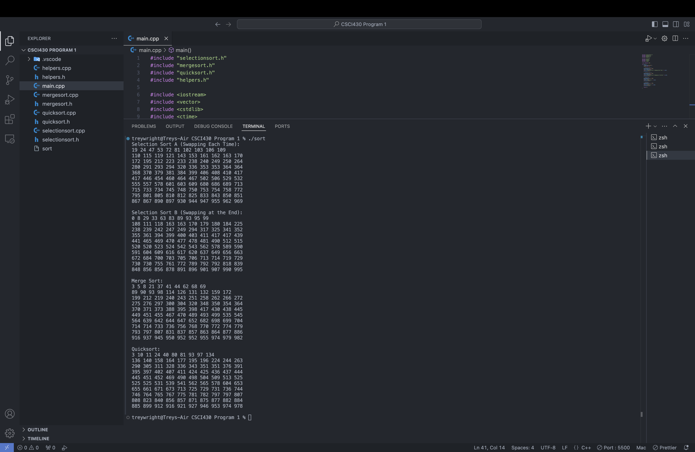

# Sorting Algorithms
Preview:


## Sorting Algorithms Implamented

- **Selection Sort A**: Swaps elements each time during selection.
- **Selection Sort B**: Only swaps at the end of selection.
- **Merge Sort**: A divide-and-conquer algorithm that merges sorted subarrays.
- **Quick Sort**: An efficient sorting algorithm using partitioning.

## Installation

To get started with this project, follow these simple steps:

1. **Clone the Repository**:
   ```bash
   git clone https://github.com/yourusername/SortingAlgorithms.git
   cd SortingAlgorithms
   ```

2. **Compile the Source Files**:
   Make sure you have a C++ compiler installed (e.g., g++) and run:
   ```bash
   g++ main.cpp selectionsort.cpp mergesort.cpp quicksort.cpp helpers.cpp -o sort
   ```

3. **Run the Program**:
   After compiling, run the executable:
   ```bash
   ./sort
   ```

## Algorithms Overview

### Selection Sort A
- **Description**: This algorithm repeatedly selects the smallest (or largest) element from the unsorted portion of the array and swaps it with the first unsorted element.
- **Time Complexity**: O(n²)

### Selection Sort B
- **Description**: Similar to Selection Sort A, but instead of swapping elements during each selection, it finds the minimum and only swaps once at the end of the iteration.
- **Time Complexity**: O(n²)

### Merge Sort
- **Description**: This divide-and-conquer algorithm recursively divides the array into halves until it can be easily sorted, then merges the sorted halves back together.
- **Time Complexity**: O(n log n)

### Quick Sort
- **Description**: Quick Sort selects a "pivot" element and partitions the other elements into two sub-arrays according to whether they are less than or greater than the pivot. The sub-arrays are then sorted recursively.
- **Time Complexity**: Average O(n log n), Worst O(n²)
